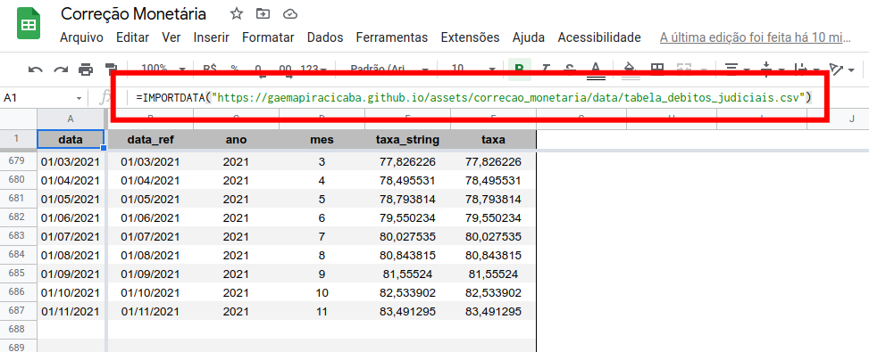

# Outros Usos

Há um arquivo _.csv_ disponível no "servidor", o qua é atualizado todas as terças-feiras e quintas, as 4h00 e fica disponível no endereço a seguir:

- <a href="https://gaemapiracicaba.github.io/assets/correcao_monetaria/data/tabela_debitos_judiciais.csv" target="_blank">https://gaemapiracicaba.github.io/assets/correcao_monetaria/data/tabela_debitos_judiciais.csv</a>

 

---

## _Google Spreadsheets_

Uma vez que o arquivo _.csv_ está disponível em um servidor, é possível utilizar a função **_=IMPORTDATA()_** do _Google Spreadsheets_ para acessa-lo diretamente na tabela, possibilitando cálculos etc.

 

---

## _Microsoft Excel_

No _Microsoft Excel_ é possível também manter o arquivo atualizado em uma aba, por meio dos passos abaixo:

 

---

## Outros Formatos

É possível também acessar a tabela em formatos _.csv_ e _.pdf_ nos botões abaixo:

<a href="https://gaemapiracicaba.github.io/assets/correcao_monetaria/data/tabela_debitos_judiciais.csv" class="btn btn--primary">Download _csv_</a>  
<a href="https://gaemapiracicaba.github.io/assets/correcao_monetaria/data/tabela_debitos_judiciais.pdf" class="btn btn--primary" target="_blank">Download _pdf_</a>
